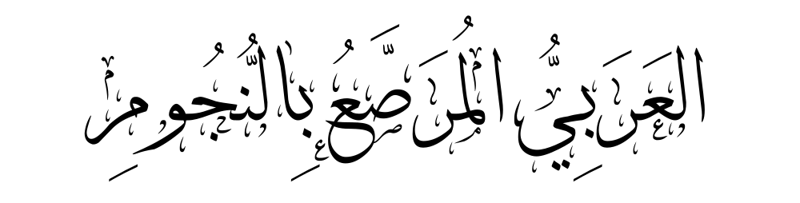

<!-- backgroundColor : "white" -->

---
# L'arabe étoilé ★
Un ensemble de beaux cours pour apprendre la langue arabe par Benstitou Sofiane.

---
# $(i)$ Les mots de liaisons
Pourquoi commencer par ça ? :
- Présents partout et dans n'importe quelle contexte !
- Pratiquer plus souvent

**<u> Compétence :</u>** Suivre pratique pour suivre les différentes étapes d'une démarche.

---

# Addition+
<section class="arabe" font-size: 70px"> ★"et" : (...)وَ</section>

#### exemple :

<section class="arabe">
(٥, ١)إِيَّاكَ نَعْبُدُ وَإِيَّاكَ نَسْتَعِينُ

</section>

C’est Toi [Seul] que nous adorons, **et** c’est Toi [Seul] dont nous implorons secours.

---
# Opposition≠
 
<section class="arabe" >★ "mais" : لَكِنْ</section>
<section class="arabe" >★★ "mais logique" : وَلَكِنْ </section>
<section class="arabe" >★★★ "mais fort" : لَكِنَّ </section>
 وَلَكِنَّ existe aussi.</section>

---
## Exemple d'oppositions :
<section class="arabe" >
★ (٣٩,٢٠) :  
لَـٰكِنِ ٱلَّذِينَ ٱتَّقَوْا۟ رَبَّهُمْ لَهُمْ غُرَفٌۭ مِّن فَوْقِهَا غُرَفٌۭ مَّبْنِيَّةٌۭ تَجْرِى مِن تَحْتِهَا ٱلْأَنْهَـٰرُ ۖ وَعْدَ ٱللَّهِ ۖ لَا يُخْلِفُ ٱللَّهُ ٱلْمِيعَادَ
</section>

Mais ceux qui auront craint leur Seigneur auront [pour demeure] des étages [au Paradis] au-dessus desquels d’autres étages sont construits et sous lesquels coulent les rivières. Promesse d’Allah ! Allah ne manque pas à Sa promesse.

---

<section class="arabe" >
★★ (٣٩,٧١) :  
 وَسِيقَ ٱلَّذِينَ كَفَرُوٓا۟ إِلَىٰ جَهَنَّمَ زُمَرًا ۖ حَتَّىٰٓ إِذَا جَآءُوهَا فُتِحَتْ أَبْوَٰبُهَا وَقَالَ لَهُمْ خَزَنَتُهَآ أَلَمْ يَأْتِكُمْ رُسُلٌۭ مِّنكُمْ يَتْلُونَ عَلَيْكُمْ ءَايَـٰتِ رَبِّكُمْ وَيُنذِرُونَكُمْ لِقَآءَ يَوْمِكُمْ هَـٰذَا ۚ قَالُوا۟ بَلَىٰ وَلَـٰكِنْ حَقَّتْ كَلِمَةُ ٱلْعَذَابِ عَلَى ٱلْكَـٰفِرِينَ
</section>
▶

---
<section class="arabe" >
★★★ (٣٩,٤٩) : 
فَإِذَا مَسَّ ٱلْإِنسَـٰنَ ضُرٌّۭ دَعَانَا ثُمَّ إِذَا خَوَّلْنَـٰهُ نِعْمَةًۭ مِّنَّا قَالَ إِنَّمَآ أُوتِيتُهُۥ عَلَىٰ عِلْمٍۭ ۚ بَلْ هِىَ فِتْنَةٌۭ وَلَٰكِنَّ أَكْثَرَهُمْ لَا يَعْلَمُونَ

</section>
<section class="petit">
Quand un malheur touche l’homme, il Nous invoque. Quand ensuite Nous lui accordons une faveur de Notre part, il dit : "Je ne la dois qu’à [ma] science." C’est une épreuve, plutôt ; mais la plupart d’entre eux ne savent pas.
</section>

---
# Cause $\Leftarrow$

<section class="arabe" font-size: 70px">★"parce que": لِأَنَّ</section>

#### exemple :
<section class="arabe">
إِنَّهُ يَوْمٌ لأنّ الشَّمْسَ قَدِ اِرْتَفَعَتْ
</section>
Il fait jour parce que le soleil s'est levé 

---
# Exemple...

<section class="arabe" font-size: 70px">★"par exemple": مَثَلًا</section>

#### exemple :
<section class="arabe">
يُمْكِنُ تَعَلُّمُ لُغَاتٍ جَدِيدَةٍ، مثلًا العَرَبِيَّةُ أَوْ الفَرَنْسِيَّةُ
</section>
On peut apprendre de nouvelles langues, par exemple l'arabe ou le français

---
# Conséquence $\Rightarrow$

<section class="arabe" font-size: 70px">★"donc" : (...)فَـ</section>

---
<section class="arabe" >
★ (٣٦,٨٣) :  
فَسُبْحَـٰنَ ٱلَّذِى بِيَدِهِۦ مَلَكُوتُ كُلِّ شَىْءٍۢ وَإِلَيْهِ تُرْجَعُونَ
</section>
Louange donc, à Celui qui détient en sa main la royauté sur toute chose ! Et c’est vers Lui que vous serez ramenés.
