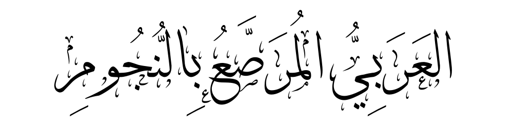
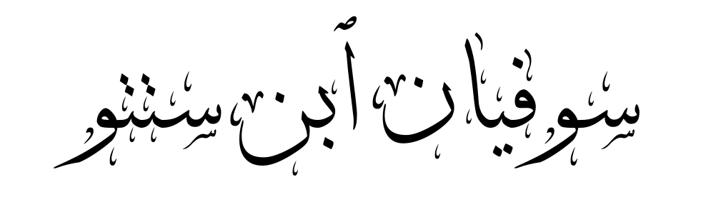

<!-- backgroundColor : "white" -->

---
# Etapes
<!-- 
<section class="arabe" font-size: 70px">★"": </section> 
-->

<section class="arabe" font-size: 70px">★"premièrement":أَوَّلًا </section>
<section class="arabe" font-size: 70px">★"deuxièmement":ثَانِيًا</section>